# Laboratory 1 Tutorial

## Generate Bitcoin Private key
As a first step in this laboratory, we need to randomly generate a Bitcoin private key. For this step we use the website [bitaddress.org](http://bitaddress.org). Bitaddress.org is an open-source project that provides a client-side Bitcoin Wallet Generator. This website uses the source of randomness generated by the movement of the mouse to create a truly random private key.

[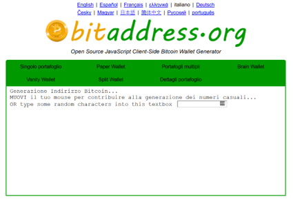](http://bitaddress.org)

To generate the private key on [bitaddress.org](http://bitaddress.org), we move the mouse around a bit until we will get a new address/private key combination.

[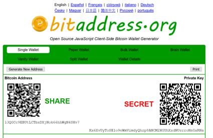](http://bitaddress.org)

The private key is the alphanumerical string in the bottom-right of the box, in this example: 

`Kx6XvUyToSE1o9eWmVimdyQhrp8ANCM2HGUhXxdNUsrroNnGaRNa`

## Import private key on Electrum wallet
After generated the private key, we need to import it in a Bitcoin wallet. For this part of the exercise we use [Electrum](http://electrum.org/#download) (for windows we suggest the portable version).

Once launched the application, we create a new default wallet and we click on "next":

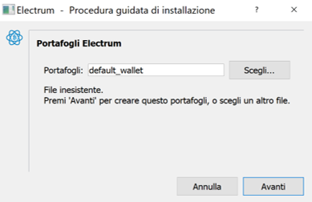

To import our private key, we now select the last entry in the menu: "Import Bitcoin addresses or private keys":

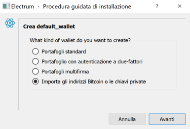

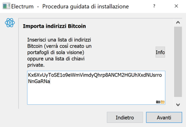

Optionally we can insert a password to protect the newly created wallet.

We can now go to the "addresses" tab and see our Bitcoin address, that must be the same as the one previously showed on bitaddress.org. In this example the Bitcoin address is:

`13QGCc9EBUtLCTbxDXjNok66hhWgN4SHv7`

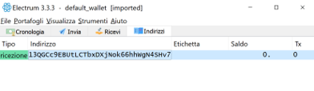

## Sign a message using Electrum
We are now ready to sign a message using our new Bitcoin wallet. 
To sign a message we go to "Instruments -> Sign/Verify message" and we insert the following data:
- the message, for example here we will use `"My first digital signature"`
- the Bitcoin address associated to our private key, in this example: `13QGCc9EBUtLCTbxDXjNok66hhWgN4SHv7`

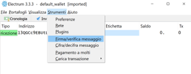

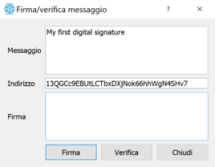

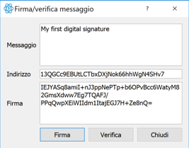

The digital signature in this example is:
`IEJYASq8amiI+nJ3ppNePTp+b6OPvBcc6WatyM82GmsXdww7Eg7TQAFJ/PPqQwpXEiWIIdm1ItajEGJ7H+Ze8nQ=`

## Verify signed message using Electrum
To verify a digital signature we need:
- the digital signature
- the signed message
- the Bitcoin address associated with the private key used to sign the message

To verify a message we go to "Instruments -> Sign/Verify message" and we insert the information in the proposed exercise:
- digital signature: `G+WptuOvPCSswt/Ncm1upO4lPSCWbS2cpKariPmHvxX5eOJwgqmdEExMTKvaR0S3f1TXwggLn/m4CbI2jv0SCuM=`
- message: `Hello, world!`
- Bitcoin address: `1FEz167JCVgBvhJBahpzmrsTNewhiwgWVG`

If we click on "Verify" we obtain:

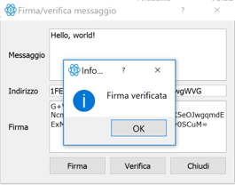

Please note that if we changed even a single character in the message, the digital signature is no longer valid. 

For example we remove "!" in the message:

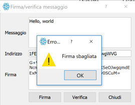

## Check address transactions on a Block Explorer
The last part of this tutorial is on the Bitcoin Block Explorer. A Bitcoin Block Explorer is an online blockchain browser which displays the contents of individual Bitcoin blocks and transactions and the informations about Bitcoin addresses (the transaction history and the balance).

There are many of different Block Explorer available online, for this tutorial we will use the one developed by [Blockstream](https://blockstream.com/) named [Esplora](https://blockstream.info).

The scope of this exercise is to check the transaction history and the balance of the Bitcoin address previously used to verify the signature: `1FEz167JCVgBvhJBahpzmrsTNewhiwgWVG`. To do that we insert the address in the search bar of the [Block Explorer](https://blockstream.info):

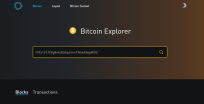

We can even search the transaction history of the previously created Bitcoin address, in this example `13QGCc9EBUtLCTbxDXjNok66hhWgN4SHv7` . Since it is a new address, the transactions history is empty and the balance is equal to 0:

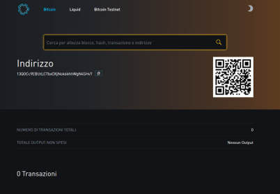

